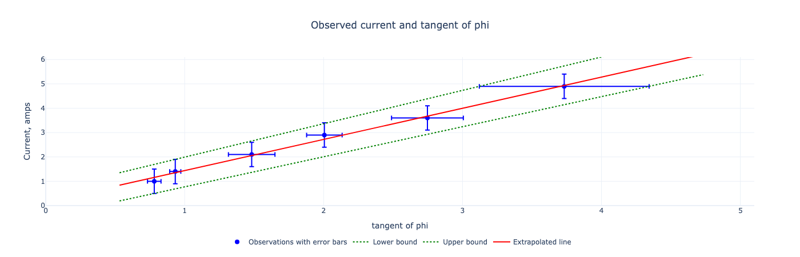

# Laboratory work 2.5

## Horizontal component of Earth's magnetic field.

### Summary

* **The given book value of Earth's magnetic field induction does fall within the bounds of the experimentally obtained value.**
  The fifth observation's calculated Earth's magnetic field induction is 13.75 micro teslas, 18.2% less than a book value in Riga.
  However, the error margin of ±3.57 micro teslas correctly estimated that the book value could be 18.2% higher than the expected value of 13.75 micro teslas.
  The geometric slope approach demonstrated that the overall expected value of the Earth's magnetic field induction is 13.41 microteslas.

* **The line chart reveals human errors during measurement.**
  The current/tangent chart points should make a straight line because their slope must be constant.
  The magnetic field of Earth, the radius of the loop and the number of turns are constants; therefore, the relationship must be linear.
  Small deviations from the line indicate that the measurement approach was inconsistent, which is a human error.

* **The geometric approach to estimating errors was incorrect.**
  The confidence interval of upper and lower line slopes is too narrow: [-0.5, +1.0] micro teslas.
  It does not contain the book value and is significantly off what it should be.
  First, the geometric approach was based on arbitrarily drawn lines to determine the upper and lower boundaries.
  The correct approach to drawing upper and lower boundaries needs a proper methodology.
  Secondly, it does not consider the partial error of measuring coil radius, although its partial error was small.

* **The largest partial error is the tangent of phi.**
  Its absolute value was 3.26, roughly three times greater than the current's partial error.
  The tangent of phi is based on the phi angle's measurements using a compass with a precision class of 1 degree.
  Hence, to get more accurate measurements, conducting the experiment again and using a more precise compass or angle measurement would lead to the best improvement.

* **The line chart demonstrates the overall systematic error as an offset of the line's trend.**
  Although random errors are visible, these are not as significant as the general offset of the line's trend from the expected book value.
  The expected line's slope should be 20% steeper; therefore, the current should be relatively more significant, or the angle phi should be relatively smaller.
  On the other hand, it could be the noise of the magnetic field that took place during the experiment. Please review the setup to see if the amperemeter provided the correct measurements, and check that all electronic devices nearby are switched off.