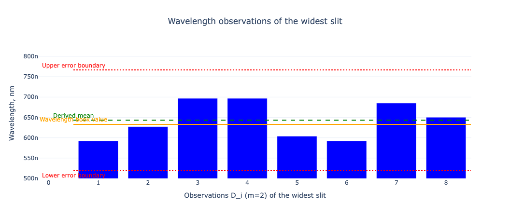
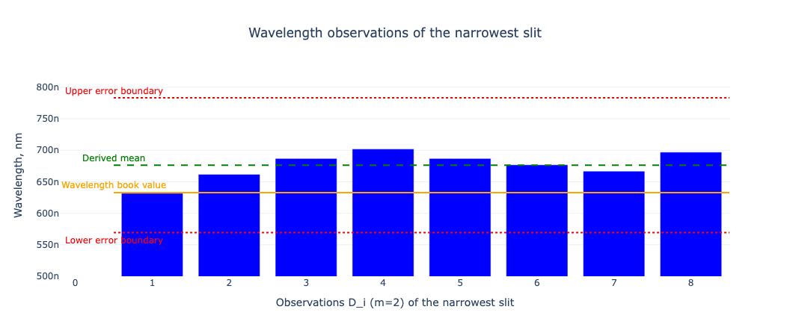

# Laboratory work 3.2.1

## Young's double slit experiment.

### Summary

* **The given book value of the diode laser wavelength (MLDD 3.0) matches experimental results.**
  The calculated wavelength is 643 nm in the widest slit experiment, and 676.2 in the narrowest slip experiment.
  It satisfies our expectations of the true wavelength of 633 nm.
  The true value is closer to the mean than the border in the confidence interval for both experiments.

* **Both experiments slightly overestimate the wavelength.**
  The mean value of the wavelength of both experiments is greater than the true value.
  Therefore, there is likely to be a systematical error in overestimating the distance between slits.
  The reason why it is less likely to be the distance from the light sources to the point under observation
  is that the partial error of $ a $ is multiple times lower than the distance between slits.
  On the other hand, it would be valuable to have more measurements of $ a $ to confirm that there is no random error.

* **The random error for the distance between slits is significantly high.**
The random error component of $ D $ is fifteen times higher than its measurement device error.
Next time, to get more precise measurements, it would be better to collect more observations of the distance between slits to reduce the random error.
