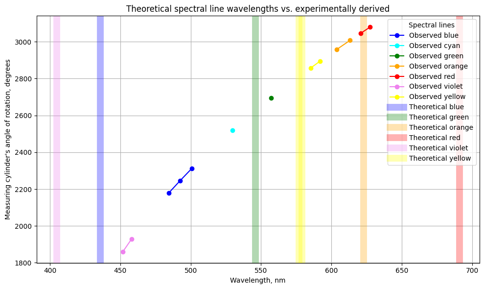

# Laboratory work 3.7.2

## Monochromator.

### Summary
* **The experimentally derived mercury spectra wavelengths resemble a similar pattern to the theoretically expected one.** Theoretically and experimentally derived relationships between wavelengths and rotation angles resembled a close-to-linear trend. The observed wavelengths are aligned in the expected pattern, starting from the violet visible spectra lines at 400ths nanometer wavelengths and ending at red spectra lines at 600ths nanometer wavelengths.

* **The experimentally derived wavelengths for green, yellow, and orange lines were under the 15-nanometer absolute error.** However, the violet, blue, and red lines were estimated with more than a 50-nanometer absolute error. Errors above 50nm are significantly inaccurate as the 50nm error even exceeds the theoretical length differences between visible lines.

* **Since both patterns resembled a close-to-linear trend, but the errors emerged symmetrically at the extremes of the visible spectra, a systematic issue appeared in the measurement process.** The pattern implies a consistent directional offset rather than random error. It is likely that the spectrometer used for the observations was improperly calibrated. Please check if the colimator is not misaligned, because it had likely lead to a consistent shift in the wavelength-to-angle relationship.
